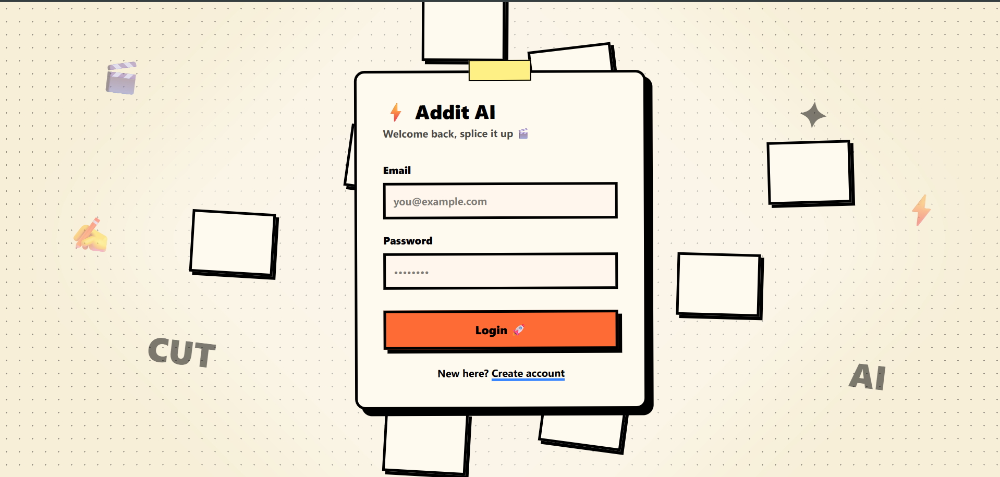
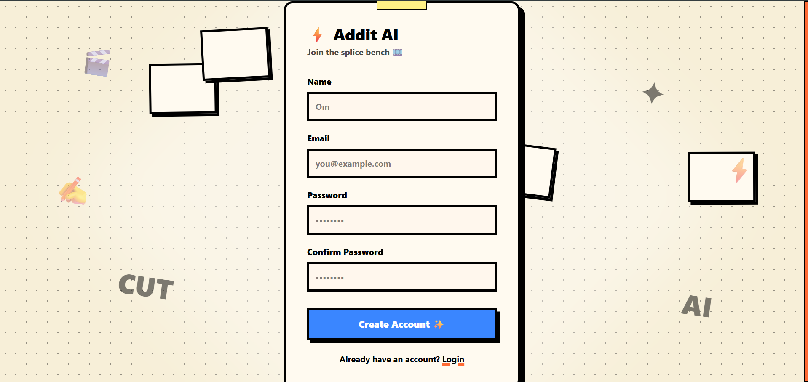
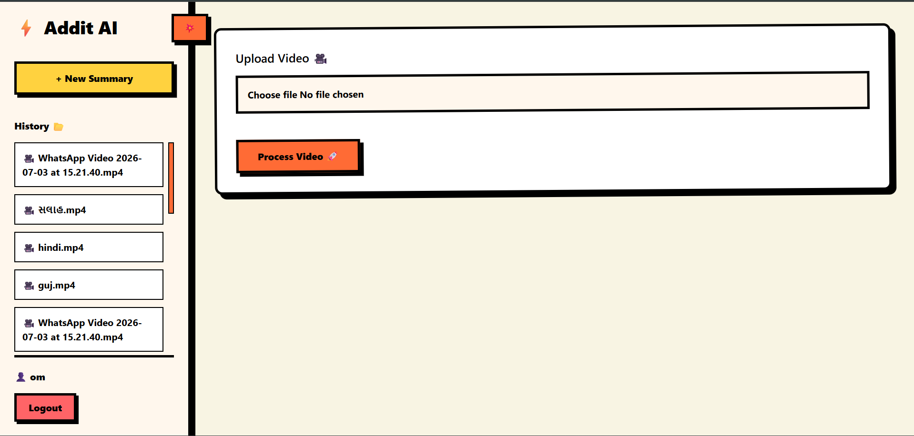
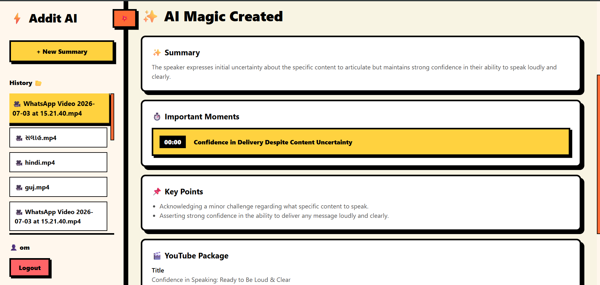

# Addit AI

AI powered video intelligence platform that transforms videos into summaries, timestamps, and creator-ready content.

---

## Features

- Video upload and processing
- Automatic audio extraction
- AI transcription using Groq Whisper
- AI content generation using Gemini
- Smart video chapters / important moments
- Key points extraction
- YouTube title & description generation
- SEO keyword generation
- JWT Authentication
- User history dashboard
- Fully Dockerized

---

## Architecture

```text
               React Frontend
                     |
                     |
                     v

                FastAPI Backend

        ┌────────────┼────────────┐
        |            |            |
        v            v            v

   PostgreSQL   Groq Whisper   Gemini AI

        |
        v

      Storage
```

---

## Tech Stack

### Frontend

- React
- Tailwind CSS
- Motion animations
- Axios


### Backend

- FastAPI
- SQLAlchemy
- Alembic
- PostgreSQL
- JWT Auth


### AI

- Groq Whisper API
- Gemini API
- FFmpeg


### DevOps

- Docker
- Docker Compose

---

## Run Locally

Clone project:

```bash
git clone <repo-url>
```

Start:

```bash
docker compose up
```

Backend:

```text
http://localhost:8000
```

Frontend:

```text
http://localhost:3000
```

---

## Environment Variables

Create:

```text
.env
```

Example:

```env
DATABASE_URL=

GROQ_API_KEY=

GEMINI_API_KEY=

SECRET_KEY=
```

---

## Screenshots

### Login



### Register



### Dashboard



### AI Result


---

## Future Roadmap

- AI video editing
- Social media upload time prediction
- Auto captions
- Creator analytics
